# PROCESS-MAP.md — VenueFlow (v2 combined platform)

> ⚠️ **Status — pre-pivot; read [`BUILD-ROADMAP.md`](./BUILD-ROADMAP.md) first (flagged 2026-06-20).**
> This lifecycle map was written for the original "absorb / replace GoHighLevel" model. As of the
> **June 16 pivot**, VF2 uses **GHL as its pre-sales backend** rather than replacing it: the
> **① Sales & Marketing** band (Unified Inbox, multi-channel Email/SMS/WhatsApp nurture, lead capture)
> lives in **GHL**, and the couple deposit is collected via a **GHL invoice (bank transfer)**, not
> Stripe-in-the-portal. VF2 owns the **②–④ post-booking** flow, which is broadly accurate below. The
> ① band, the "deposit via Stripe", and the "No GoHighLevel" goal are **superseded** by
> `BUILD-ROADMAP.md`. Treat this doc as vision narrative, not current build authority.

The end-to-end journey for a single wedding, from first enquiry to post-event,
across the unified VenueFlow platform (sales + event management). This is the
"one record, the whole journey" thesis from `PRODUCT.md` made concrete: who
acts, on what surface, through which channel, and what the system does
automatically.

A seeded, clickable prototype of these surfaces lives at **`/preview`** (no login).

---

## The lifecycle at a glance

```mermaid
flowchart LR
  subgraph SALES["① SALES & MARKETING (absorb GoHighLevel)"]
    A[Enquiry captured] --> B[Brochure auto-sent]
    B --> C[Multi-channel nurture\nEmail · SMS · WhatsApp]
    C --> D[Viewing / call booked]
    D --> E[Viewing attended]
  end
  subgraph MONEY["② BOOKING → MONEY (the bridge)"]
    E --> F[Proposal sent]
    F --> G[Contract e-signed]
    G --> H[Deposit paid → DATE BOOKED]
  end
  subgraph PLAN["③ EVENT MANAGEMENT (enter Sonas's domain)"]
    H --> I[Wedding Workspace opens]
    I --> J[Run-sheet · floor plan · guests · menu · suppliers]
    J --> K[Final details locked]
  end
  subgraph DAY["④ EVENT DAY & AFTER"]
    K --> L[Event-day mobile mode]
    L --> M[Final balance settled]
    M --> N[Archived · review · referral]
  end
  COUPLE([Couple Portal]) -.pays/signs/plans.-> MONEY
  COUPLE -.guests/menu/seating.-> PLAN
  COPILOT([AI Wedding Copilot]) -.assists.-> SALES & MONEY & PLAN
```

---

## Stage-by-stage

Each row: **pipeline stage** (the fixed 8-stage spine) · **who acts** · **surface** · **channels** · **what the system does automatically**.

### ① Sales & Marketing

| Stage | Actor | Surface | Channels | Automation |
|---|---|---|---|---|
| **Inbound enquiry** | Couple | Embedded enquiry form | — | Contact + opportunity created, source-tagged; lands in Unified Inbox & pipeline |
| | | | | Brochure auto-delivered within ~1 min; AI drafts a suggested first reply |
| **Responded** | Staff | Unified Inbox | Email / SMS / WhatsApp | Reply from one thread; channel auto-selected; quick templates; conversation logged on the contact |
| | System | — | multi-channel | Fixed 3-step nurture fires across channels; stops on reply/booking; bounce/STOP suppression |
| **Viewing interest** | Staff/Couple | Booking widget | — | AI lead score (date proximity, budget, guests, responsiveness) flags hot leads |
| **Appointment booked** | Couple | Public booking widget | confirmations + reminders | Slot reserved against real staff availability; double-booking guarded; reminders auto-scheduled |
| **Appointment attended** | Staff | Contact timeline | — | Outcome logged; Copilot suggests next action (send proposal) |

### ② Booking → Money

| Stage | Actor | Surface | Channels | Automation |
|---|---|---|---|---|
| **Date on hold** | Staff → Couple | Proposal builder → Couple Portal | proposal link | Branded itemized proposal (package + add-ons); date held; expiry reminder |
| | Couple | Couple Portal ("pay & sign") | — | E-sign contract + T&Cs (audit trail); deposit via Stripe |
| **Wedding booked** | System | — | confirmation all channels | On deposit paid: opportunity → *Wedding booked*; **Wedding Workspace opens**; payment schedule generated (interim + final balance) with auto-reminders; accounting sync (Xero/QuickBooks); 🎉 celebration moment |

### ③ Event Management (post-booking)

| Surface | Actor | What happens |
|---|---|---|
| **Wedding Workspace** (hub) | Staff | Countdown, payment status, task checklist, key facts, links to every planning tool |
| **Run-sheet / timeline** | Staff | Build the day; assign supplier arrival times |
| **Floor plan & seating** | Staff + Couple | Visual layout; drag guests to tables |
| **Guest list + RSVPs** | Couple (portal) | Guests, +1s, dietary/allergens — entered at source |
| **Menu & catering** | Couple + Staff | Per-guest choices → automatic allergen rollup + kitchen counts |
| **Suppliers + document hub** | Staff | Assign vendors, share run-sheet, store contracts/insurance |

### ④ Event day & after

| Surface | Actor | What happens |
|---|---|---|
| **Event-day mobile mode** | Coordinator (iPad) | Today's run-sheet, final guest counts, supplier check-in |
| **Final balance** | Couple (portal) | Settle balance; receipt + accounting sync |
| **Archived** | System | Opportunity archived; review/referral request; full-lifecycle reporting captures the outcome |

---

## Cross-cutting flows

- **Couple Portal** is the couple's single surface across the whole post-enquiry journey — pay, sign, plan — white-labeled to the venue. It is the *data front door*: guest lists, menu choices and seating are entered by couples, never re-keyed by staff.
- **AI Wedding Copilot** spans all bands: drafts messages, scores leads, answers "what's left for the Hendersons?", flags at-risk bookings and overdue payments.
- **Unified reporting** stitches the lifecycle end to end: lead-source ROI → conversion rate → booked revenue → payment health → event delivery.

---

## Goals & success metrics

### Product goals
1. **Kill the two-tool tax.** A venue runs its *entire* operation — sales and event management — in VenueFlow alone. No GoHighLevel, no Sonas, no re-keying.
2. **Win on modernity at both ends.** Every surface feels a generation newer than GoHighLevel's config maze and Sonas's form-heavy UI.
3. **Hold the opinionated line.** Full lifecycle coverage with *zero* config maze — templates, not builders (see `PRODUCT.md` › Configurability).
4. **One continuous record.** Enquiry → event day → archive with no data leaving the spine.

### Success metrics (targets)
| Metric | Target |
|---|---|
| Self-onboard to first live enquiry form | < 15 min |
| Brochure delivered after enquiry | < 1 min |
| Enquiries with a first response | 100% (no lead unanswered) |
| First-response time (any channel) | < 5 min during staffed hours |
| Enquiry → booking conversion uplift vs prior stack | measurable +; tracked per source |
| Post-booking data re-keyed by staff | ~0 (couples enter their own) |
| Tools a venue pays for | 1 (VenueFlow) |
| Couple portal adoption (booked weddings using it) | > 80% |
| Final balance collected on time | > 95% (auto-reminders) |

### Non-goals (v2)
- No kitchen stock / provisioning / inventory (catering-ERP territory — cut).
- No workflow/automation builder, no field builder, no page builder (opinionated structure is the product).
- No couple access to the sales/CRM app (portal only, post-booking).

---

*See `PRODUCT.md` › The Combined Platform for the module map, configurability rules, and the M8–M13 roadmap. See `DESIGN.md` for the visual system every surface above must follow.*
