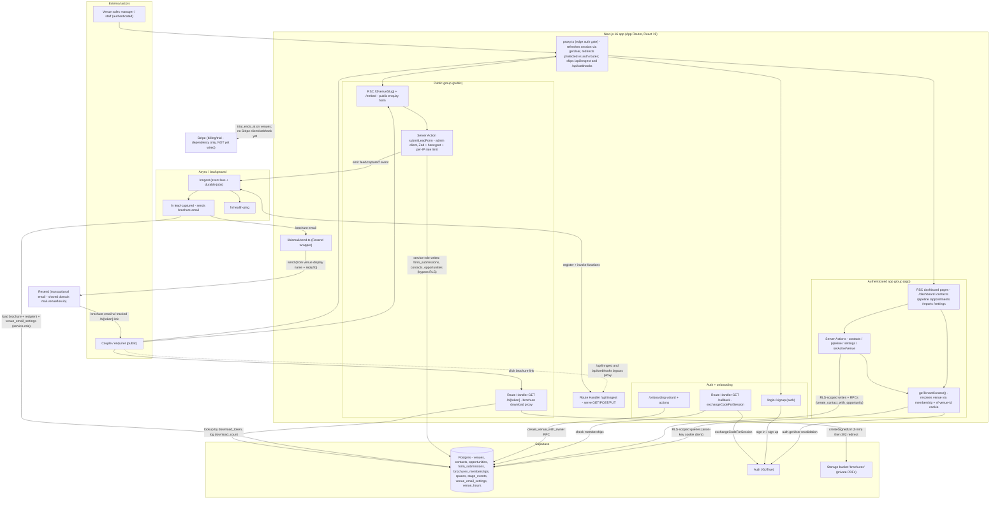
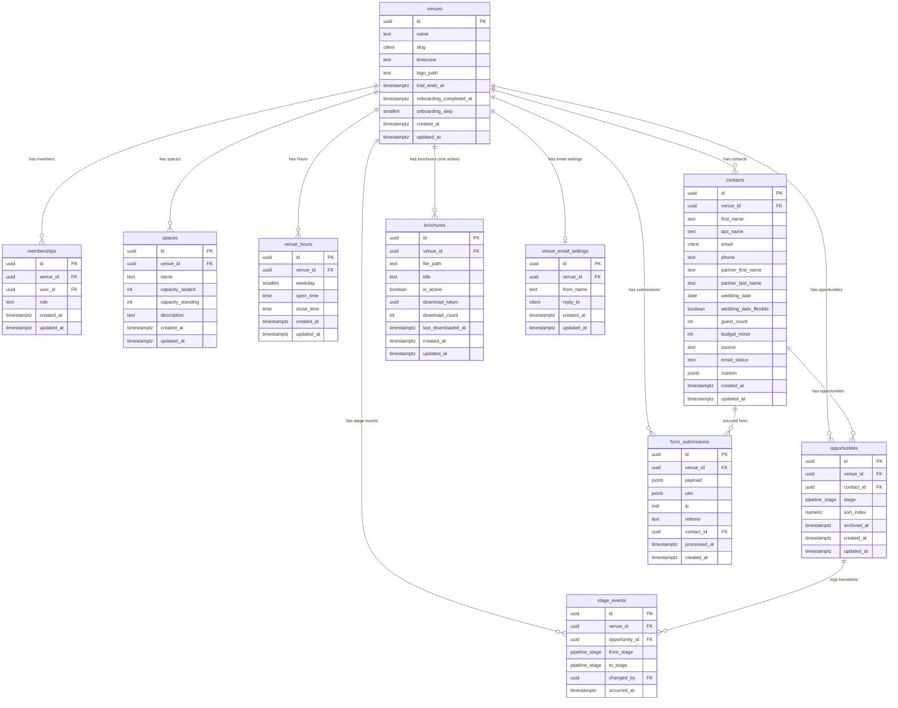
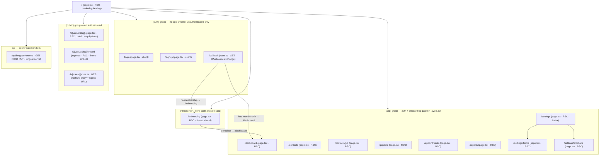
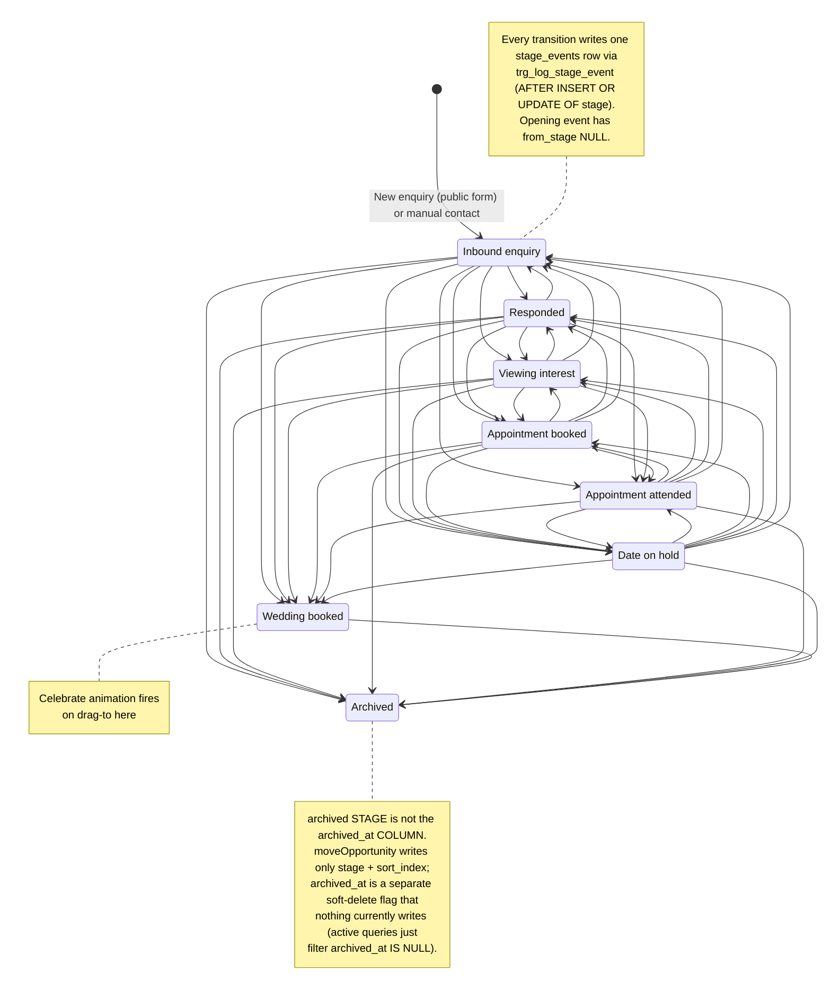
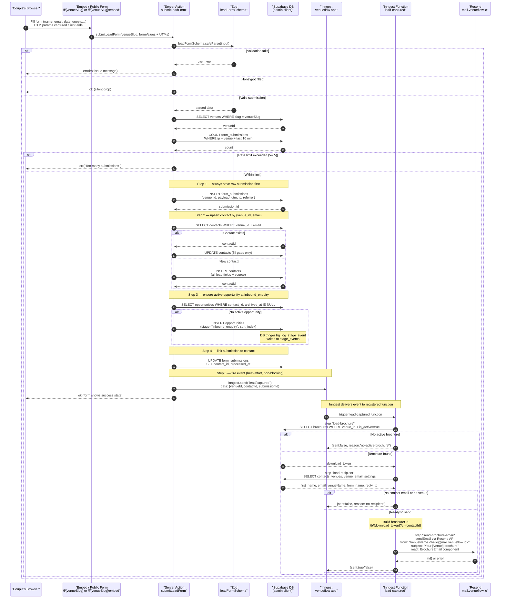
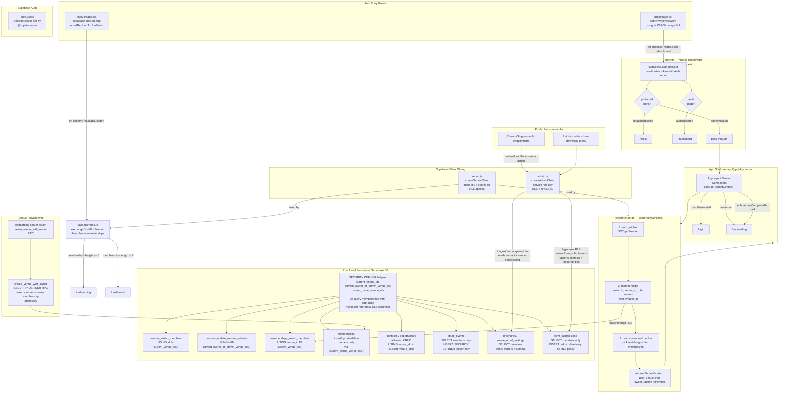

# VenueFlow — Architecture & Diagrams

VenueFlow is a multi-tenant CRM for UK wedding venues. It captures an enquiry from a couple via a public form, automatically emails the venue's brochure, nurtures the lead, lets staff book a viewing, and tracks the relationship through an 8-stage Kanban pipeline that ends at "Wedding booked." Every row of operational data is siloed by `venue_id`, with Postgres Row-Level Security and membership-based roles enforcing tenant isolation. The app is built on Next.js 16 (App Router, RSC + Server Actions) with Supabase for data/auth/storage, Inngest for event-driven background jobs, and Resend for transactional email.

## Stack at a glance

| Layer | Technology | Role |
| --- | --- | --- |
| Framework | Next.js 16.2.9 (App Router) | RSC pages, Server Actions, Route Handlers |
| Edge / middleware | `proxy.ts` (Next 16 middleware replacement) | Per-request session refresh + protected/auth route gating |
| UI runtime | React 19.2.4 | Server + client components |
| Language | TypeScript | Type safety across app + generated DB types |
| Data / Auth / Storage | Supabase (`@supabase/ssr`) | Postgres, Auth (GoTrue), Storage, RLS |
| Background jobs | Inngest 4.5 | Event bus + durable functions (`lead-captured`, `health-ping`) |
| Email | Resend 6 + `@react-email/components` | Transactional brochure email (shared `mail.venueflow.io`) |
| Billing | Stripe 22 | Billing/trial — dependency only, not yet wired |
| Styling / components | Tailwind v4 + shadcn / Radix UI | Design system + accessible primitives |
| Drag & drop | dnd-kit | Pipeline Kanban drag-and-drop |
| Charts | recharts | Reports |
| Validation | zod 4 + react-hook-form | Form + payload validation |
| E2E testing | Playwright | End-to-end tests |

## How to read this

All diagrams below are Mermaid and render natively on GitHub or in the VS Code Mermaid preview.

## System Architecture (C4 Container)

VenueFlow is a multi-tenant wedding-venue CRM on Next.js 16 (App Router, RSC + Server Actions + Route Handlers). proxy.ts (Next 16's middleware replacement) refreshes the Supabase session on every request and gates protected vs auth routes, but deliberately bypasses /api/inngest. Authenticated staff use cookie-based, RLS-scoped Supabase queries (active venue resolved by getTenantContext via membership + vf-venue-id cookie), while the public enquiry form writes through the service-role admin client (no anon RLS on form_submissions). A captured lead always persists first (form_submission -> contact -> opportunity), then emits the Inngest "lead/captured" event whose durable function emails the venue's brochure via Resend with a tracked /b/[token] link that mints a short-lived Supabase Storage signed URL. Stripe is an installed dependency and venues.trial_ends_at exists, but no Stripe client, billing logic, or webhook route is wired yet.

**Known gaps / not yet built:**
- Stripe is in package.json (stripe ^22.2.0) but there is no Stripe client, billing/subscription logic, or checkout/webhook code anywhere in src. The 'billing/trial' container is effectively unbuilt.
- proxy.ts matcher excludes /api/webhooks, but no src/app/api/webhooks route exists yet — it's a reserved path for a future external webhook receiver (likely Stripe).
- Trial state: only venues.trial_ends_at exists in the generated DB types; no stripe_customer_id or subscription columns, and nothing in app code reads trial_ends_at — trial enforcement is not implemented.
- Inngest is only event-bus + 2 functions (lead-captured, health-ping). The lead-captured comment mentions 'future nurture enrollment' / sequences (M4) but no nurture/sequence functions exist yet.
- Appointments and reports pages exist as routes but were not read in this scope; their data flows are assumed to be the same RSC + RLS-scoped Supabase pattern, not verified.
- Email sending degrades silently when RESEND_API_KEY is unset (logs + skips) — in local dev no email is actually delivered.
- Inngest client (src/inngest/client.ts) has no signing key / event key configured in code; relies on env/Inngest defaults — signing/auth config for the /api/inngest endpoint not verified.

## Database Schema — Full ER Diagram

All 10 application tables across 5 migrations (M1 tenancy layer through M3 lead capture). Multi-tenancy is enforced by a `venue_id` foreign key on every table — every query is scoped to venues the calling user belongs to via the `memberships` join table. RLS is enabled on all 10 tables; write access is further stratified by membership role (owner/admin vs member) using three SECURITY DEFINER helper functions that avoid self-referential recursion on `memberships`. The `stage_events` table and the `brochures.download_count` column are append/increment-only — no direct client INSERT policy exists; writes flow through a SECURITY DEFINER trigger (`log_stage_event`) and a service-role server action respectively.

**Known gaps / not yet built:**
- No configurable pipeline stages yet — pipeline_stage is a fixed 8-value PostgreSQL enum; the migration comment explicitly notes 'MVP — no configurable pipelines'
- brochures.download_count is incremented by a server action (service-role), not a DB trigger — the increment logic lives in application code, not in a migration
- No subscriptions or Stripe billing table exists in any migration; Stripe integration (mentioned in app context) has no schema counterpart yet
- venue_email_settings has no DKIM/SPM domain-verification columns — custom sending domains are not yet modelled
- No sequences/email_sequences table exists; M4 'sequences' feature referenced in memory is not yet in the schema

## App Router Route Map

Full App Router route map for VenueFlow. Routes are organised by route group: (app) is the authenticated shell (layout enforces auth + onboarding guard), (auth) holds login/signup/callback with no app chrome, (public) holds the venue-facing enquiry form and brochure download proxy with no auth, and onboarding sits outside both groups so it can be reached by partially-authenticated users. The / root is a standalone marketing landing page. Key redirect flows are shown as edges: the OAuth callback fans out to /dashboard or /onboarding based on membership presence, and the (app) layout short-circuits to /login or /onboarding when auth/venue is missing.

**Known gaps / not yet built:**
- No middleware.ts found — auth guarding is done inside individual layouts/pages (defense-in-depth comment in (app)/layout.tsx mentions a proxy gate upstream, but no middleware file exists in the repo)
- The root / page.tsx has no redirect logic — it renders a static marketing landing; no link to /login or /signup is wired in the page itself (buttons say 'Get started' but have no href)
- /appointments page exists but there is no appointments-specific actions.ts or sub-route (no [id] detail view for appointments)
- No /contacts/[id] sub-routes beyond the single detail page — no edit or delete dedicated route
- Inngest functions registered: healthPing and leadCaptured only — email sequence functions (M4) not yet present

## Opportunity Pipeline State Machine

The VenueFlow pipeline is a fixed 8-stage enum with no enforced directed transitions at the database or server-action level. Any card can be dragged or menu-moved to any other stage freely; the `moveOpportunity` server action accepts any valid `pipeline_stage` value as the target. Every stage change — including the initial INSERT at `inbound_enquiry` — is automatically recorded in the `stage_events` table by a SECURITY DEFINER trigger (`trg_log_stage_event`). The two de-facto terminal states are `wedding_booked` (triggers a confetti animation) and `archived`. Note: the `archived` *stage* and the `archived_at` *column* are independent in the current code — `moveOpportunity` updates only `stage` + `sort_index` and never sets `archived_at`; `archived_at` is a separate soft-delete flag, and the active-opportunity partial unique index plus all board/contact queries simply filter `archived_at IS NULL`. All transitions shown are therefore "allowed"; the diagram reflects free movement rather than a constrained FSM.

**Known gaps / not yet built:**
- No server-side guard enforces a specific allowed-transitions set — any stage can go to any stage. If a directed FSM is ever needed, it would need to be added as a Postgres check or server-action allowlist.
- The `archived` *stage* does not set the `archived_at` *column* — `moveOpportunity` writes only `stage` + `sort_index`. `archived_at` is a separate soft-delete flag that no current code path writes (it is only read, via `archived_at IS NULL` filters). There is no unarchive action, and nothing in the UI sets `archived_at`.
- stage_events has a `changed_by` column (auth.users FK) that powers a contact activity timeline, but no timeline UI component was found in the scanned files — that surface may not be built yet.
- No Inngest event is fired on stage transitions currently; the downstream hook in f/[venueSlug]/actions.ts fires on lead capture (brochure delivery) not on stage changes. Future nurture enrollment on stage change is noted as a TODO in that file.

## Lead Capture → Brochure → Nurture Flow

End-to-end sequence from a couple submitting the public enquiry form to receiving their brochure email. The Server Action does five sequential writes — raw submission, contact upsert, opportunity creation, submission linkage, and finally fires the "lead/captured" Inngest event best-effort. The Inngest function "lead-captured" then runs three idempotent steps: load brochure, load recipient context, send via Resend. Only the brochure email is implemented today; the 3-step nurture sequence mentioned in PRODUCT.md is not yet built. The embed variant at /f/[venueSlug]/embed/page.tsx reuses the identical LeadForm component and the same server action — the only difference is transparent background and no header chrome.

**Known gaps / not yet built:**
- 3-step nurture sequence referenced in PRODUCT.md and in actions.ts comment ('future nurture enrollment') — no Inngest function, no email templates, no step.sleep delays exist yet
- No step.sleep or step.waitForEvent calls anywhere in lead-captured.ts — the function is single-shot (brochure only)
- No nurture opt-out / unsubscribe tracking table or email_status update path from Resend webhooks
- Brochure download proxy route (/b/[token]) — referenced in brochureUrl construction but not in the scoped files; download_count increment logic not verified
- No captcha (acknowledged in code as 'no captcha for MVP'); rate limit is pure IP-count only
- venue_email_settings has no verified sending domain per-venue — all email shares mail.venueflow.io with only display-name and reply-to varying per venue

## Auth, Multi-Tenancy, and RLS Model

VenueFlow is a single-binary multi-tenant SaaS where every row of operational data is siloed by venue_id. Sign-in has two paths: password sign-in (`signInWithPassword`) pushes straight to /dashboard, while magic-link (`signInWithOtp`) and the signup email-confirmation both land on /callback, which routes the user to /onboarding or /dashboard based on whether a memberships row exists. Every authenticated app request is first validated by proxy.ts (auth.getUser revalidation), then again by getTenantContext() inside the app shell layout, which resolves the active venue via the vf-venue-id cookie. RLS is enforced through three SECURITY DEFINER helper functions (current_venue_ids, current_owner_or_admin_venue_ids, current_owner_venue_ids) that query memberships without triggering self-referential recursion; every tenant-scoped table's USING clause calls one of these. The service-role admin client bypasses RLS and is used wherever there is no authenticated Supabase session: the public enquiry form + embed page reads (venue name/logo), the lead-capture server action, the brochure download proxy, and the Inngest background functions.

**Known gaps / not yet built:**
- Multi-venue switching: `setActiveVenue()` (src/app/(app)/actions.ts) IS implemented — it validates the user's membership and sets the `vf-venue-id` cookie (httpOnly, 1-year) — but no venue-switcher UI calls it yet, so a user in multiple venues can't switch from the interface.
- Role enforcement in the app shell: getTenantContext returns role (owner/admin/member) but src/app/(app)/layout.tsx does not gate any route by role. Role-based UI restrictions (e.g. hiding settings from members) have not been implemented.
- Invite flow: memberships_insert_owners policy exists in the DB, meaning owners can add members, but there is no invite UI or server action in the codebase.
- form_submissions has a rate-limit check in the server action (5 per IP per 10 min) but no CAPTCHA or bot-protection beyond the honeypot field.
- Storage RLS on the brochures bucket gates reads to authenticated members, but the public download proxy (/b/[token]) generates a signed URL via the admin client — the signed URL is then accessible by anyone with the link, regardless of membership, which is intentional but undocumented.

## Onboarding Wizard Flow

End-to-end flow of the three-step onboarding wizard. The server page resolves auth and venue state before handing off to the client wizard; each step calls a dedicated server action that writes to Supabase and advances `venues.onboarding_step`; step 3 sets `venues.onboarding_completed_at` and triggers a redirect to /dashboard. Back-navigation and skip paths are shown for steps 2 and 3. Resume logic (reading `onboarding_step` from the DB) lets owners pick up where they left off if they close and return.

```mermaid
flowchart TD
    ENTRY["/onboarding — server page.tsx"]

    ENTRY --> AUTH{Authenticated?}
    AUTH -- No --> LOGIN["/login redirect"]
    AUTH -- Yes --> VENUE_EXISTS{Venue exists?<br/>venues.onboarding_completed_at}

    VENUE_EXISTS -- "completed_at NOT NULL" --> DASH["/dashboard redirect"]
    VENUE_EXISTS -- "no venue at all<br/>reason: no-venue" --> S1_FRESH["Step 1 — fresh start<br/>onboarding_step = 1"]

    VENUE_EXISTS -- "incomplete venue<br/>+ role = member" --> WAITING["Waiting screen<br/>'Owner is still setting up'"]

    VENUE_EXISTS -- "incomplete venue<br/>+ owner or admin" --> LOAD_STEP["Read venues.onboarding_step"]
    LOAD_STEP -- "step = 3" --> LOAD_HOURS["Read venue_hours<br/>for resume"]
    LOAD_STEP -- "step = 1 or 2" --> RESUME_STEP
    LOAD_HOURS --> RESUME_STEP["Resume at saved step<br/>onboarding_step 1, 2, or 3"]

    S1_FRESH --> WIZARD
    RESUME_STEP --> WIZARD["OnboardingWizard client component<br/>wizard.tsx"]

    subgraph STEP1 ["Step 1 — Venue Profile  step1-venue.tsx"]
        S1_FORM["Fields: name, slug, timezone<br/>Optional: logo upload"]
        S1_FORM --> S1_ACTION["createVenueWithProfile<br/>actions.ts"]
        S1_ACTION -- "stale incomplete venue exists?<br/>memberships join venues" --> S1_UPDATE["UPDATE venues<br/>name, slug, timezone<br/>onboarding_step = 2"]
        S1_ACTION -- "no stale venue" --> S1_RPC["RPC create_venue_with_owner<br/>INSERT venues + memberships<br/>role = owner"]
        S1_RPC --> S1_TZ["UPDATE venues.timezone"]
        S1_UPDATE --> S1_LOGO
        S1_TZ --> S1_LOGO["Optional: upload logo<br/>storage venue-assets<br/>UPDATE venues.logo_path"]
        S1_LOGO --> S1_STEP["UPDATE venues.onboarding_step = 2"]
    end

    WIZARD --> STEP1
    S1_STEP -- "onComplete venueId" --> STEP2

    subgraph STEP2 ["Step 2 — First Space  step2-space.tsx"]
        S2_FORM["Fields: name, capacity_seated<br/>capacity_standing, description<br/>or Skip"]
        S2_FORM -- "submit" --> S2_ACTION["saveSpace<br/>INSERT spaces"]
        S2_FORM -- "skip" --> S2_SKIP["saveSpace skip<br/>no INSERT spaces"]
        S2_ACTION --> S2_STEP["UPDATE venues.onboarding_step = 3"]
        S2_SKIP --> S2_STEP
    end

    S2_STEP -- "onComplete" --> STEP3

    subgraph STEP3 ["Step 3 — Opening Hours  step3-hours.tsx"]
        S3_FORM["7-row weekday editor<br/>Mon-Sat default 09:00-17:00<br/>Sun default closed<br/>hours-defaults.ts"]
        S3_FORM -- "save" --> S3_ACTION["finishHours rows<br/>UPSERT venue_hours x7<br/>onConflict venue_id,weekday"]
        S3_FORM -- "skip" --> S3_SKIP["finishHours skip<br/>UPSERT DEFAULT_HOURS"]
        S3_ACTION --> S3_COMPLETE["UPDATE venues<br/>onboarding_completed_at = now()"]
        S3_SKIP --> S3_COMPLETE
    end

    STEP3 -- "Back" --> STEP2
    STEP2 -- "Back" --> STEP1

    S3_COMPLETE -- "onComplete" --> CELEBRATE["Celebration pulse<br/>~560ms desktop<br/>0ms mobile or reduced-motion"]
    CELEBRATE --> FINAL["/dashboard redirect<br/>router.push + router.refresh"]
```

**Known gaps / not yet built:**
- Logo upload is fire-and-forget (non-fatal) — there is no retry UI or user-visible error if it fails; the venue is still created
- Step 2 skip writes no spaces row at all; there is no placeholder or stub space created, which means a venue can legitimately have zero spaces after onboarding completes
- The 'stale incomplete venue' check in createVenueWithProfile guards against duplicate venues but silently reuses the oldest incomplete venue — this could surface unexpected data if a user created two incomplete venues via the RPC before the guard was added
- venue_hours upsert is keyed on venue_id,weekday — re-running finishHours (e.g. via Back then re-submit) overwrites existing rows silently with no conflict warning
- There is no email or Inngest event fired on onboarding completion; any welcome/activation automation would need to be added
- The member waiting screen has no polling or real-time subscription — the member must manually refresh to detect when the owner finishes onboarding

## Booking & Appointments Flow — Current State

The /b/[token] route is a brochure download proxy — not a booking link. It resolves an opaque download_token from the brochures table, increments a download counter, and 302-redirects to a short-lived signed URL for the PDF in Supabase Storage. The appointments page (/appointments) is an explicit placeholder stub reading "Appointment scheduling coming in M5." The venue_hours table is populated during onboarding step 3 (weekday, open_time, close_time) but is not consumed by any scheduling logic. Appointment tracking today is purely pipeline-stage-based: staff manually drag opportunities into appointment_booked and appointment_attended Kanban columns with no automated scheduling, calendar writes, or availability checks.

```mermaid
flowchart TD
    subgraph PUBLIC ["Public routes"]
        BToken["/b/[token]<br/>GET route handler"]
        BToken -->|"1. lookup download_token<br/>in brochures table"| BrochuresDB[("brochures<br/>table")]
        BrochuresDB -->|"2. increment download_count<br/>set last_downloaded_at"| BrochuresDB
        BrochuresDB -->|"3. createSignedUrl<br/>5-min TTL"| Storage[("Supabase Storage<br/>brochures bucket")]
        Storage -->|"4. 302 redirect"| PDFDownload["PDF delivered<br/>to browser"]
    end

    subgraph ONBOARDING ["Onboarding — venue_hours seeded here"]
        Step3["Step 3 — Hours UI<br/>/onboarding step3-hours.tsx"]
        Step3 -->|"finishHours server action<br/>upsert on venue_id,weekday"| VenueHoursDB[("venue_hours<br/>weekday 0-6<br/>open_time / close_time")]
    end

    subgraph PIPELINE ["Pipeline — appointment stages are manual Kanban columns"]
        KanbanBoard["/pipeline Kanban board"]
        KanbanBoard -->|"drag card → moveOpportunity<br/>server action"| StageEnum["pipeline_stage enum<br/>appointment_booked<br/>appointment_attended"]
        StageEnum -->|"written to"| OpportunitiesDB[("opportunities<br/>table")]
        OpportunitiesDB -->|"transition logged to"| StageEventsDB[("stage_events<br/>table")]
    end

    subgraph APPOINTMENTS_STUB ["Staff appointments page — not built"]
        AppPage["/appointments page<br/>stub: coming in M5"]
    end

    note1["NOTE: /b/[token] is the brochure<br/>download proxy, NOT a booking link.<br/>No booking token route exists yet."]
    note2["NOTE: venue_hours exists in DB<br/>but no availability engine reads it.<br/>It is not wired to any booking UI."]

    style APPOINTMENTS_STUB fill:#f5f5f5,stroke:#ccc,color:#888
    style note1 fill:#fff8dc,stroke:#e0c040,color:#555
    style note2 fill:#fff8dc,stroke:#e0c040,color:#555
```

**Known gaps / not yet built:**
- No appointments table exists in the DB schema — appointment_booked/appointment_attended are only pipeline_stage enum values, not first-class appointment records
- No booking token or self-scheduling public route — /b/[token] is the brochure proxy, not a booking link
- venue_hours data is collected at onboarding but no availability engine reads or queries it
- No calendar integration (Google Calendar, iCal, etc.) — no calendar writes anywhere in codebase
- No meeting type distinction (viewing vs. call) — not modelled in DB or UI
- No staff availability or working hours beyond per-venue open/close times (no per-staff calendar, no blocked slots)
- No confirmation emails or reminders for booked appointments — lead-captured Inngest function only sends the brochure email
- The /appointments sidebar link goes to a stub page — entire subsystem deferred to M5
- No public-facing booking page or self-serve slot picker exists

## Known gaps & open questions

### Billing / Stripe
- Stripe is in package.json (`stripe ^22.2.0`) but there is no Stripe client, billing/subscription logic, or checkout/webhook code anywhere in src. The 'billing/trial' container is effectively unbuilt.
- `proxy.ts` matcher excludes /api/webhooks, but no `src/app/api/webhooks` route exists yet — it's a reserved path for a future external webhook receiver (likely Stripe).
- Trial state: only `venues.trial_ends_at` exists in the generated DB types; no `stripe_customer_id` or subscription columns, and nothing in app code reads `trial_ends_at` — trial enforcement is not implemented.
- No subscriptions or Stripe billing table exists in any migration; Stripe integration has no schema counterpart yet.

### Background jobs / Inngest
- Inngest is only event-bus + 2 functions (`lead-captured`, `health-ping`). The lead-captured comment mentions 'future nurture enrollment' / sequences (M4) but no nurture/sequence functions exist yet.
- Inngest client (`src/inngest/client.ts`) has no signing key / event key configured in code; relies on env/Inngest defaults — signing/auth config for the /api/inngest endpoint not verified.
- No Inngest event is fired on stage transitions currently; the downstream hook in `f/[venueSlug]/actions.ts` fires on lead capture (brochure delivery) not on stage changes. Future nurture enrollment on stage change is noted as a TODO.
- There is no email or Inngest event fired on onboarding completion; any welcome/activation automation would need to be added.

### Nurture / Email
- 3-step nurture sequence referenced in PRODUCT.md and in actions.ts comment ('future nurture enrollment') — no Inngest function, no email templates, no `step.sleep` delays exist yet.
- No `step.sleep` or `step.waitForEvent` calls anywhere in `lead-captured.ts` — the function is single-shot (brochure only).
- No nurture opt-out / unsubscribe tracking table or `email_status` update path from Resend webhooks.
- No sequences/email_sequences table exists; M4 'sequences' feature referenced in memory is not yet in the schema.
- Email sending degrades silently when `RESEND_API_KEY` is unset (logs + skips) — in local dev no email is actually delivered.
- `venue_email_settings` has no verified sending domain per-venue — all email shares `mail.venueflow.io` with only display-name and reply-to varying per venue. No DKIM/SPM domain-verification columns — custom sending domains are not yet modelled.

### Pipeline / Opportunities
- No configurable pipeline stages yet — `pipeline_stage` is a fixed 8-value PostgreSQL enum; the migration comment explicitly notes 'MVP — no configurable pipelines'.
- No server-side guard enforces a specific allowed-transitions set — any stage can go to any stage. If a directed FSM is ever needed, it would need to be added as a Postgres check or server-action allowlist.
- The `archived` *stage* does not set the `archived_at` *column*; `moveOpportunity` writes only `stage` + `sort_index`. `archived_at` is a separate soft-delete flag nothing currently writes (only read via `IS NULL` filters). No unarchive action exists.
- `stage_events` has a `changed_by` column (auth.users FK) that powers a contact activity timeline, but no timeline UI component was found in the scanned files — that surface may not be built yet.

### Lead capture / Anti-bot
- No captcha (acknowledged in code as 'no captcha for MVP'); rate limit is pure IP-count only (5 per IP per 10 min) with a honeypot field as the only other protection.

### Brochure / Storage
- `brochures.download_count` is incremented by a server action (service-role), not a DB trigger — the increment logic lives in application code, not in a migration.
- Brochure download proxy route (`/b/[token]`) — referenced in brochureUrl construction but not in the scoped files; download_count increment logic not verified.
- Storage RLS on the brochures bucket gates reads to authenticated members, but the public download proxy (`/b/[token]`) generates a signed URL via the admin client — the signed URL is then accessible by anyone with the link, regardless of membership, which is intentional but undocumented.

### Auth / Tenancy / Roles
- Multi-venue switching: `setActiveVenue()` (src/app/(app)/actions.ts) is implemented (validates membership, sets the `vf-venue-id` cookie) but no venue-switcher UI calls it yet — a user in multiple venues can't switch from the interface.
- Role enforcement in the app shell: `getTenantContext` returns role (owner/admin/member) but `src/app/(app)/layout.tsx` does not gate any route by role. Role-based UI restrictions (e.g. hiding settings from members) have not been implemented.
- Invite flow: `memberships_insert_owners` policy exists in the DB, meaning owners can add members, but there is no invite UI or server action in the codebase.

### Routing / Middleware
- No `middleware.ts` found — auth guarding is done inside individual layouts/pages (defense-in-depth comment in `(app)/layout.tsx` mentions a proxy gate upstream, but no middleware file exists in the repo).
- The root `/` page.tsx has no redirect logic — it renders a static marketing landing; no link to /login or /signup is wired in the page itself (buttons say 'Get started' but have no href).
- No `/contacts/[id]` sub-routes beyond the single detail page — no edit or delete dedicated route.

### Onboarding
- Logo upload is fire-and-forget (non-fatal) — there is no retry UI or user-visible error if it fails; the venue is still created.
- Step 2 skip writes no spaces row at all; there is no placeholder or stub space created, which means a venue can legitimately have zero spaces after onboarding completes.
- The 'stale incomplete venue' check in `createVenueWithProfile` guards against duplicate venues but silently reuses the oldest incomplete venue — this could surface unexpected data if a user created two incomplete venues via the RPC before the guard was added.
- `venue_hours` upsert is keyed on `venue_id,weekday` — re-running finishHours (e.g. via Back then re-submit) overwrites existing rows silently with no conflict warning.
- The member waiting screen has no polling or real-time subscription — the member must manually refresh to detect when the owner finishes onboarding.

### Booking / Appointments (M5)
- No appointments table exists in the DB schema — `appointment_booked`/`appointment_attended` are only `pipeline_stage` enum values, not first-class appointment records.
- No booking token or self-scheduling public route — `/b/[token]` is the brochure proxy, not a booking link.
- `venue_hours` data is collected at onboarding but no availability engine reads or queries it.
- No calendar integration (Google Calendar, iCal, etc.) — no calendar writes anywhere in codebase.
- No meeting type distinction (viewing vs. call) — not modelled in DB or UI.
- No staff availability or working hours beyond per-venue open/close times (no per-staff calendar, no blocked slots).
- No confirmation emails or reminders for booked appointments.
- The `/appointments` sidebar link goes to a stub page — entire subsystem deferred to M5. No public-facing booking page or self-serve slot picker exists.

### Reports / Other (not verified in scope)
- Appointments and reports pages exist as routes but were not read in this scope; their data flows are assumed to be the same RSC + RLS-scoped Supabase pattern, not verified.
- `/appointments` page exists but there is no appointments-specific actions.ts or sub-route (no [id] detail view for appointments).
- Inngest functions registered: `healthPing` and `leadCaptured` only — email sequence functions (M4) not yet present.
